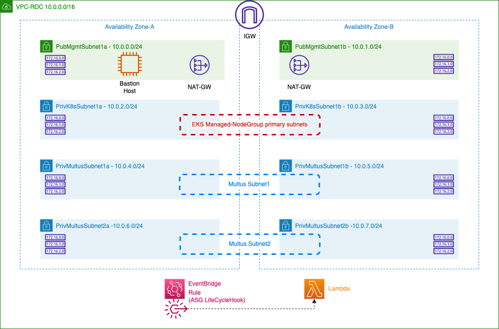
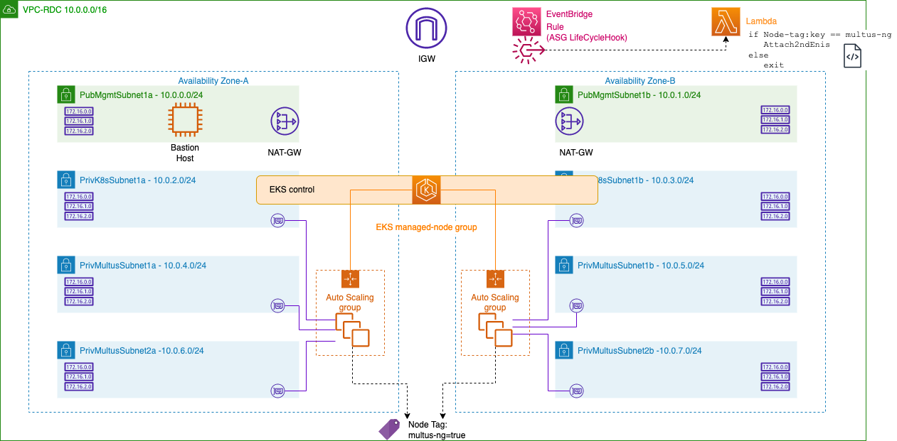
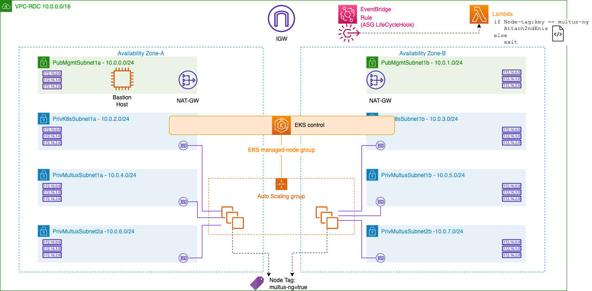

# Multus-CNI Ready EKS-Managed Node Group 


## Introduction

This Github repo is to guide how we can use EKS-managed nodegroup (MNG) for Multus required Container applications in AWS using Lambda function. For this purpose, site introduces 3 CFN files. 




* vpc-infra.yaml  - this is to create VPC, subnets, route tables, EKS cluster, IGW, NAT-GW for basic infra environment. 

* eks-mng-lct.yaml - this is to create LaunchTemplate for EKS managed nodegroup. We can define instance type/size, ssh key pair, and tag for each node. Tag is important, since Lambda is attaching additoinal multus interfaces to worker node based on each Tag. 

* amazon-lambda-for-eksmng-multus.yaml - this creates,

  * EventRule - using EKS MNG's lifecycel hook, it triggers Lambda 
  * Lambda Function - Lambda to trigger Multus interface attach. 

  This Lambda supports 2 AZs (as an example, but you can add more AZ support) and multiple subnets from each AZ. This Lambda is inherited from https://github.com/raghs-aws/eks-install-guide-for-multus/blob/main/cfn/templates/nodegroup/lambda_function.zip


First deployment model you can think about is having EKS-MNGs per AZ. In this case, you can use `eks.amazonaws.com/nodegroup=NODE_GROUP_NAME` , as a nodeSelector to place pod to a dedicated MNG. 




Also you can consider to make MNG spreading across 2 AZs like below figure. In this case, you can use `topology.kubernetes.io/zone=YOUR_EC2_AZ` as a nodeSelector to place a pod to the AZ where you configure NetworkAttachmentDefinition along with subnets of the AZ. For this model, you have to give 2 lists of multus-subnets (for each AZ) when you run the CFN for Lambda, and then you have to create EKS MNG over 2 subnets (one each from one AZ). 




## License 

This library is licensed under the MIT-0 License. See the LICENSE file.


## Security

See [CONTRIBUTING](CONTRIBUTING.md#security-issue-notifications) for more information.


## Usage

1. Create environment using `vpc-infra.yaml` or you can use your existing environment (VPC and EKS cluster). 

2. Please create a S3 bucket to store Lambda code. 

3. Find `upload-lambda.sh` from Lambda directory. After you give excutable permission to this shell script, run this with your S3 bucket name.

   `````
   ./upload-lambda.sh crosscom-my-lambda
   `````

   This script will make zip file of `lambda_function.py` and upload it to your own S3 bucket. Please make sure you are running this shell script in the machine where you have a S3 access permission. Shell sciprt generates zip file as default name of  `eks-mng-multus-lambda.zip` (but you can change file name if you want by editing the shell script). You have to use this s3 bucket name and s3 key name while you create Lambda by CFN in step 4.

4. Create LaunchTemplate using the CFN of `eks-mng-lct.yaml`. You have to select your own 'tag' which has to be matching to the one you will give in Lambda creation of step 4.

5. Create Lambda using the CFN of `amazon-lambda-for-eksmng-multus.yaml`.
   * *MultusSbunetsAz1* - list of subnets to create multus interfaces at AZ1. 
   * *MultusSbunetsAz2* - list of subnets to create multus interfaces at AZ2. 
   * *MultusSecurityGroupIds* - Security Group (or list of Security Groups) applied to multus interface(s).
   * *EksNodeGroupTagKey* - Tag Key that will trigger Lambda AttachENI action. (e.g. `multus-ng`).
   * *LambdaS3Bucket* - S3 bucket name where `eks-mng-multus-lambda.zip` is uploaded.
   * *LambdaS3Key* - Lambda file name (e.g. `eks-mng-multus-lambda.zip` unless you didn't change it).
   * *useIPsFromStartOfSubnet* - whether to use IP assignment logic of Lambda (to start from smaller number available in the subnet). 
   * *MultusInterfaceTags* - This is optional, if you want to add a Tag to the multus interface (e.g. with CNF name).  

6. Create NodeGroup from EKS console or CLI using LauncthTemplate created by step 3. 


## Under the Hood (how it works)

1. This artifact uses EventBridge event rule for LifeCycleHook action (`instant-launching`) to trigger Lambda function. 
2. In Lambda function, it looks up `Tag` of each node, whether to proceed 2nd interface attachment. 
3. If Node has a relevant `Tag`, then first it looks up AZ of primary K8s interface. Based on this result, it takes one of the list for multus-subnet (2 list defined for 2 AZs), and attaches interfac(es) from chosen list of subnet(s). 
4. Afterward action is identical to original Lambda function created in https://github.com/aws-samples/cfn-nodegroup-for-multus-cni/blob/main/lambda/lambda_function.py
